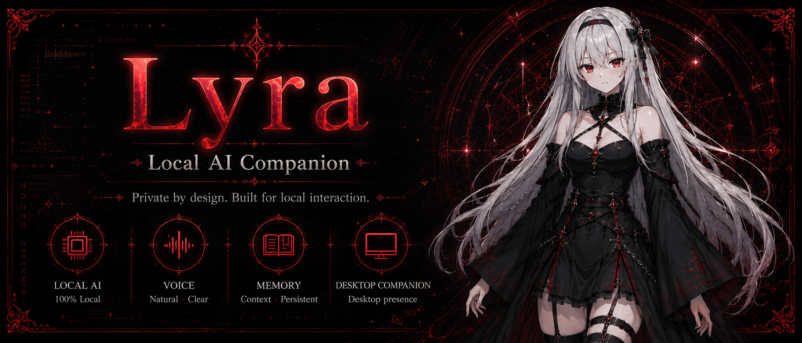
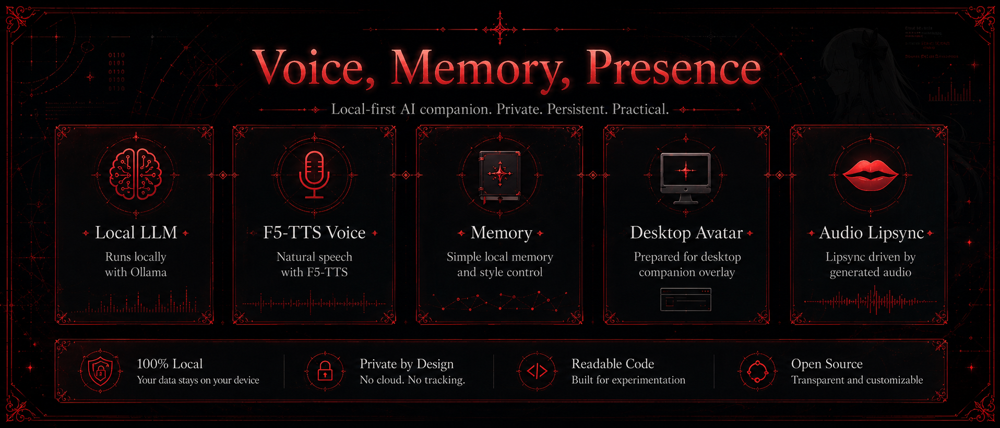
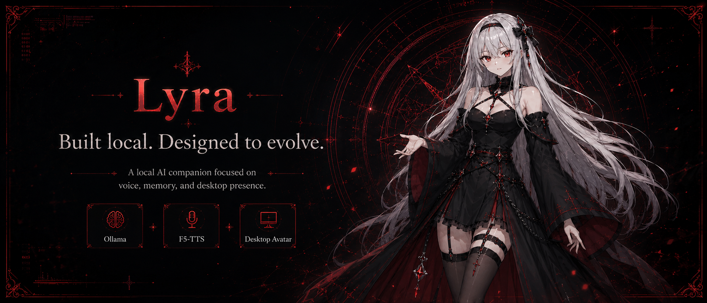

# Lyra



**Lyra** is a local AI companion focused on voice, memory, personality, and desktop presence.

Originally started as a terminal-based local assistant, Lyra is now evolving into a desktop companion designed to combine local intelligence, voice interaction, persistent memory, and visual presence.

The goal is to explore what a truly local AI companion can become when voice, personality, and desktop interaction are treated as first-class parts of the experience.

---

## Vision

Lyra is not meant to be just another chatbot wrapper.

The project aims to create a local AI companion that can:

* think through a local LLM
* speak through local voice synthesis
* maintain contextual memory
* react visually to interaction states
* display an animated desktop avatar
* synchronize lipsync with generated speech
* evolve toward more contextual and reactive interactions

Everything is designed with a **local-first** mindset:

* no cloud dependency
* no external avatar applications
* transparent architecture
* customizable behavior
* modular internal systems

---

## Current Status

Lyra is currently under active experimental development.

The MVP already includes:

* terminal conversation interface
* local response generation with Ollama
* JSON-driven personality system
* local memory foundation
* F5-TTS voice synthesis
* asynchronous audio generation/playback queue
* speech text normalization
* avatar state output
* generated-audio lipsync foundation
* interaction states such as:

```text
idle
thinking
speaking
```

The current architecture is intentionally simple, but built to evolve.

---



## Core Systems

### Local Intelligence

Lyra runs entirely on local language models through Ollama.

Current default model:

```text
llama3.1:8b
```

The LLM layer is isolated from the rest of the architecture, allowing future experimentation with:

* different local models
* model routing
* hybrid reasoning strategies
* contextual decision layers

---

### Voice

Voice is a central part of Lyra's identity.

Current voice stack:

* F5-TTS
* sounddevice
* soundfile
* numpy
* torch

Voice pipeline currently supports:

* local speech generation
* reference voice conditioning
* transcript-based voice control
* async generation queue
* direct local playback
* generated audio analysis for lipsync

Voice is treated as a core interaction layer rather than an optional output.

---

### Memory & Personality

Lyra includes lightweight local memory and behavioral control.

Current internal logic includes:

* persona configuration
* style control
* local memory
* routing logic
* response orchestration
* simple local safety behavior

This keeps interactions consistent while allowing the project to remain understandable and hackable.

---

### Avatar System

The previous VTube Studio integration was removed.

Lyra is now being rebuilt around its own desktop avatar system.

Current avatar foundation:

* local state output
* visual state tracking
* lipsync-ready architecture
* sprite-based expression system

Current sprite structure:

```text
base.png
eye_open.png
eye_closed.png
eye_serious.png
eye_happy.png
mouth_closed.png
mouth_middle_open.png
mouth_open.png
mouth_surprise.png
mouth_smile.png
```

The desktop overlay is the next major milestone.

---

## Desktop Companion Direction

Lyra is transitioning from a terminal assistant into a visual desktop companion.

Planned overlay behavior includes:

* desktop companion overlay
* transparent overlay window
* click-through mode
* idle breathing animation
* automatic blinking
* state-driven expression switching
* mouth movement during speech
* thinking state animations
* lightweight runtime without external dependencies

The first implementation focuses on efficient sprite-based animation rather than full Live2D complexity.

---

## Internal Architecture

```text
project_lyra/
├── app/
│   ├── brain/
│   ├── core/
│   ├── llm/
│   ├── memory/
│   ├── ui/
│   ├── utils/
│   ├── vision/
│   └── voice/
├── assets/
│   └── lyra/
├── config/
├── data/
│   ├── audio/
│   ├── avatar/
│   ├── brain/
│   ├── knowledge/
│   ├── memory/
│   ├── models/
│   ├── vision/
│   └── voice/
│       └── reference/
├── desktop/
├── scripts/
├── tests/
├── main.py
└── requirements.txt
```

---

## Technical Highlights

* Python core architecture
* Ollama local inference
* F5-TTS voice synthesis
* async voice queue
* generated-audio lipsync
* JSON persona system
* modular project layout
* local-first design
* desktop companion foundation

---



## Roadmap

### Completed

* [x] Local CLI chat
* [x] Persona system
* [x] Local LLM integration
* [x] F5-TTS voice generation
* [x] Async audio queue
* [x] Direct local audio playback
* [x] Removal of VTube Studio dependency
* [x] Avatar state output
* [x] Lipsync foundation

---

### In Progress

* [ ] Native desktop avatar overlay
* [ ] Mouth sprite animation
* [ ] Automatic blinking
* [ ] Thinking visual state
* [ ] State-based expression switching
* [ ] Faster cached interactions

---

### Planned

* [ ] Microphone input
* [ ] System audio capture
* [ ] Wake word support
* [ ] Context-aware interaction triggers
* [ ] Screen/context awareness
* [ ] Better long-term memory
* [ ] Local automation hooks
* [ ] Desktop actions

---

## Demo

YouTube walkthrough coming soon.

Planned demo coverage:

* local conversation loop
* F5-TTS speech generation
* avatar expression switching
* lipsync behavior
* desktop overlay interaction

---

## Design Philosophy

Lyra is built around a few simple ideas:

* local-first
* privacy-focused
* visually present
* modular by design
* easy to inspect
* easy to extend
* practical over overengineered

The objective is to build something understandable, personal, and extensible — not a black-box assistant.

---

## Current Limitations

As an active experimental project, some systems are intentionally minimal:

* memory is still lightweight
* avatar animation is sprite-based
* lipsync is volume-driven
* desktop overlay is in development
* autonomous behavior is not enabled yet

These are current MVP constraints, not final architectural limitations.

---

## Project Note

Lyra is a personal local AI companion experiment focused on combining:

* local intelligence
* voice interaction
* memory continuity
* visual desktop presence

The long-term goal is to create a local companion that feels interactive, responsive, and more present during interaction — while remaining fully under user control.
